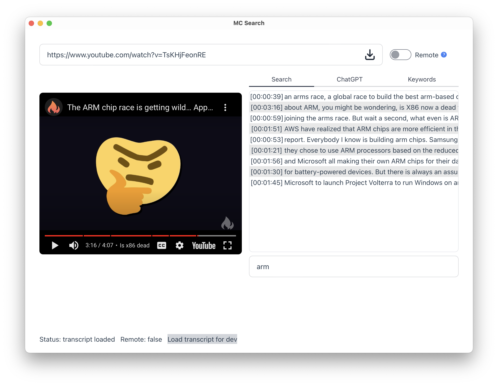

# Media Content Search

<p align="center">
  
  <figcaption><i>Imagined by @strikebhack, generated by @midjourney</i></figcaption>
</p>

Search in the content of a video. It uses machine learning to generate the
transcript in which you can then do a simple text search. You can click on one
line of the transcript to set the video to the corresponding timestamp.

You can run the transcritpion locally on your machine or remotely using
[Replicate](https://replicate.com/)'s hardware.



## How to run

### Prerequisites

MacOS:
```
brew install ffmpeg
```

Fedora:
```
sudo dnf install -y ffmpeg
```

### Prerequisites - Remote feature (Replicate)

If you don't have hardware powerful enough to run the transcription model in a
reasonable time, you have the possibility to run it remotely. It requires an API
KEY to use Replicates's service, as well as `rclone` installed on your machine
It abstracts the use of personal cloud storage. You can configure `rclone` to
use the service of your choice (Goodle Drive, Dropbox, etc.).

When using Replicate, the file you want to get the transcript for needs to be
available for that service. It is possible to upload directly on Replicate but
that's limited to small files (less than 20MB).

See [`rclone`](https://rclone.org/install/) for install instructions.

### Python setup

This app uses `pyo3` to run some tasks in python (e.g. `yt-dl`).

Setup a python environment for `pyo3`:
```
python3 -m venv venv
source venv/bin/activate
cd backend
pip install -r requirements
deactivate
cd ..
```

### Download a model

The local execution is done with `whisper-rs` which is a wrapper around
`whisper.cpp`. Here is an example of how to download a model (see
https://github.com/ggerganov/whisper.cpp ):

```
git clone https://github.com/ggerganov/whisper.cpp.git
cd whisper.cpp
bash ./models/download-ggml-model.sh base.en
cp models/ggml-base.en.bin <path_to_media_content_search>/models/
```

### Run

```
cd app

# It will install the binary. Only tested on macos.
cargo tauri build

# Alternatively for devs
cargo tauri dev
```

## TODO

- [ ] Add a config file (for API key)
- [ ] Save transcriptions locally
- [ ] (feature) Batch processing
- [ ] (ux) Improve feedback on progression
- [ ] (feature) Load local files and other media types (e.g. podcast)
- [x] (feature) Upload file to personal cloud storage to handle large files (for
remote exec)
- [ ] (feature) Interact with an LLM about the content
- [ ] (feature) List keywords, the idea is to get a general idea about the
content (names, places, etc.)
- [ ] Packaging (including python interpreter for `pyo3`)
- [ ] (ux) Display user Replicate account info (estimate billing)?
